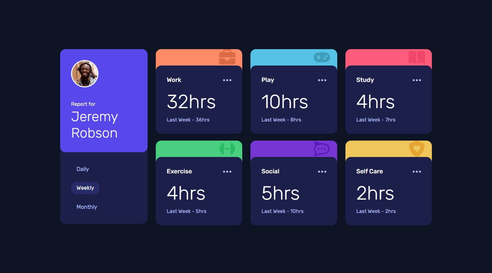
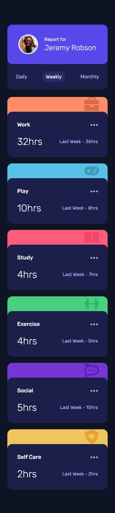

## Frontend Mentor Challenge 25 - Time Tracking Dashboard

This is my solution to the [Time Tracking Dashboard](https://www.frontendmentor.io/challenges/time-tracking-dashboard-UIQ7167Jw) challenge on [Frontend Mentor](https://www.frontendmentor.io/).

#

### Links. 🔗

- Live Site URL: https://time-tracking-dashboard-darkstarxdd.vercel.app/?tab=weekly

#

### Screenshots of the Solution (Desktop & Mobile). 🔍

#

### Built with. 🔨

- HTML & CSS.
- TypeScript.
- Zod - To validate the data received from the server (a JSON file in this case).
- Motion (formerly Framer Motion) - Used for some small initial load animations.
- Vite.

#

### Features. ✨

- Built according to the [ARIA Tab Patterns](https://www.w3.org/WAI/ARIA/apg/patterns/tabs/) guide.

#

### Notes. 📌

- I think this project should have been done using a framework like React. If so, it would have been faster to get done, with much more cleaner code and will be easier to maintain.
- Since i went the vanilla way, the first problem i saw was that i would have to repeat the same card markup 18 times (6 cards into 3 panels) inside my HTML. To avoid this, initially i generated the markup with JavaScript. So i would have the markup for one card in JS, and then once the data was retrieved and validated i would loop over the data and create all the card markup and append it to the DOM. This was working fine but since the cards were not in the initial HTML when the page was rendered, there was this annoying layout shift that happened when the cards were later added using JavaScript.
- There were few options to counter this like showing a loading state until the data was retrieved and the cards were generated, but i eventually ended up hard coding all the card markup in the HTML. So now once the data is retrieved, only the hour values are updated using JS.
- I left the initial solution where the cards were dynamically generated in it's own branch - [solution/dynamic-card-generation](https://github.com/DarkstarXDD/time-tracking-dashboard/tree/solution/dynamic-card-generation)
- Also it's my first time using TypeScript in a project, so was hitting lot of roadblocks regarding the errors TS was throwing.

#

### Testing and Accessibility. 🧪

- Tested site usability with keyboard-only navigation.
- Used the Responsively App to check the site's appearance on various screen sizes, from 320x480 to 3000x2000.
- Set the browser font size on desktop to various values ranging from 9px to 72px to make sure everything on the site scales properly with the user's preferred browser font size.
- Zoomed the page in and out using Ctrl + Scroll wheel (up to 500%).
- Tested with the NVDA screen reader.
- Viewed the site on an iPhone 11 in both portrait and landscape modes.
- Performed Lighthouse and PageSpeed tests. ([PageSpeed Result.](https://pagespeed.web.dev/analysis/https-time-tracking-dashboard-darkstarxdd-vercel-app/njvkg6x5nn?form_factor=mobile))

#

- Some Tools I Use - [DarkstarXDD/tools](https://gist.github.com/DarkstarXDD/4b1844eda12f34b667a0c36e05fcbdf9)
- My Frontend Mentor Profile - [@DarkstarXDD](https://www.frontendmentor.io/profile/DarkstarXDD)
